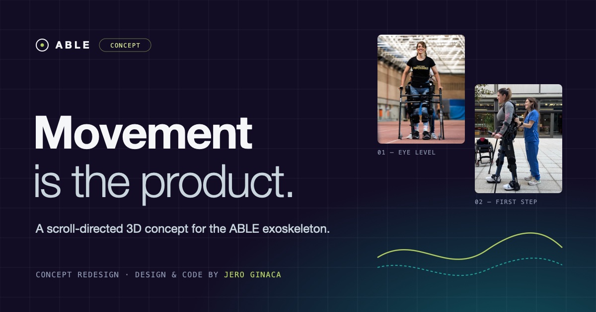

# ABLE: a concept redesign

**Live:** https://jeroginaca.github.io/able-redesign/



An unofficial, scroll-directed 3D site for the [ABLE Exoskeleton](https://ablehumanmotion.com/en), designed and built by [Jero Ginaca](https://www.linkedin.com/in/jeronimoginaca). It's built around one idea: **the product is motion, so the site should move.**

> This is a portfolio piece. It isn't affiliated with or endorsed by ABLE Human Motion. Photography and product facts belong to ABLE and its published research. They're used here for illustration and cited on the page. The demo and newsletter forms aren't connected to anything, and the page is marked `noindex` so it never competes with the real brand in search.

## The brief I set myself
ABLE's current site talks to two audiences at once: people with spinal cord injury, and the clinic directors who buy the device. The redesign keeps one continuous story for both. It opens on the emotion (standing at eye level again) and ends on what a procurement committee actually asks, with every claim sourced.

## The chapters
1. **Hero:** a live chronophotograph, after Étienne-Jules Marey (1882). A procedural user walks in the exoskeleton with crutches, trailed by stick-figure "exposures" of earlier moments in the stride. The ground scrolls at exactly the stance foot's speed, so nothing skates.
2. **Why it matters:** the emotional line, revealed word by word as you scroll.
3. **Anatomy of a step:** a side-on gait lab where scrolling walks one gait cycle through its 8 phases. Live knee and hip angle arcs, a synced knee/hip chart and a scrubber.
4. **The device:** an orbiting x-ray exploded view with leader-line callouts, plus a spec strip (9.8 kg, 150–190 cm, ≤100 kg, C5–L5, <7 min).
5. **A stride over time:** sessions 1→12. The stride and cadence open up while footprints accumulate and the published outcome multipliers count up.
6. **For clinics:** the six procurement questions (CE, evidence, throughput, reimbursement, staff, references), including a live throughput calculator.
7. **Network:** a dotted globe with pins and arcs from Barcelona.
8. **Impact + CTA:** 200+ people, 1,000,000+ steps, and a demo booking.

## How it's built
- Hand-written HTML, CSS and JavaScript with no framework and no build step. [three.js](https://threejs.org) handles 3D and bloom, and [Lenis](https://lenis.darkroom.engineering) handles smooth scroll.
- One WebGL canvas sits behind the whole page. A "scroll director" maps each section's scroll progress to camera, figure and effect parameters, then blends between sections.
- The figure, exoskeleton and gait are procedural: a bone rig driven by a typical sagittal-plane gait pattern. A real CAD/GLB of the device would drop into the same rig.
- The layout adapts for desktop, landscape tablets and phones, supports light and dark themes, and honours `prefers-reduced-motion`.
- **Show content gaps** in the footer highlights copy that would need ABLE's sign-off before going live. It's a handoff tool for a real client review.

## Run it locally
```bash
python3 -m http.server 8931
```
Then open http://localhost:8931. After editing, run `python3 build.py` to regenerate `ABLE-standalone.html`, a single file that opens by double-click. It still loads three.js, Lenis and the fonts from their CDNs.

## Files
- `index.html`: page structure and all copy
- `css/style.css`: design system (Inter / Geist Mono, lime `#b0ca62` on deep indigo `#120d24`)
- `js/main.js`: gait model, 3D figure and exoskeleton, Marey ghosts, globe, scroll director
- `js/land.js`: 1° world land mask for the dotted globe

## Sources for the facts used
- ablehumanmotion.com/en (200+ people, 1M+ steps, <6 min donning claim, countries)
- Wright M.A. et al., *J NeuroEng Rehabil* 20:45 (2023), PMC10091314: n=24, Institut Guttmann + Heidelberg, 9.8 kg, 150–190 cm, ≤100 kg, fitting 6:50 ± 2:50, ×2.6 walking time, ×3.0 steps, ×2.1 10MWT, ×1.9 6MWT, QUEST 31.7/40 (patients) and 31.6/40 (11 therapists)
- CE 2797 under MDR 2017/745, April 2024; indication SCI C5–L5, elbow extensors ≥4/5 (company announcement and Exoskeleton Report)
- *J NeuroEng Rehabil* 2024 (PMC11464447); *Disability & Rehabilitation* 47(23) 2025; ClinicalTrials.gov NCT04876794, NCT05590065, NCT05643313, NCT07062575

## What a real launch would still need from ABLE
- Reimbursement codes and payer precedents per market (Q4)
- Staff onboarding format and length (Q5)
- Named reference sites in the Netherlands and the UK (Network)
- Clinical dossier PDF (CTA), plus real demo-booking and newsletter endpoints
- Clinical/regulatory sign-off on the device-behaviour lines in the gait-phase descriptions
- Recorded joint-angle data to replace the illustrative gait kinematics, and a CAD/GLB model to replace the procedural device
